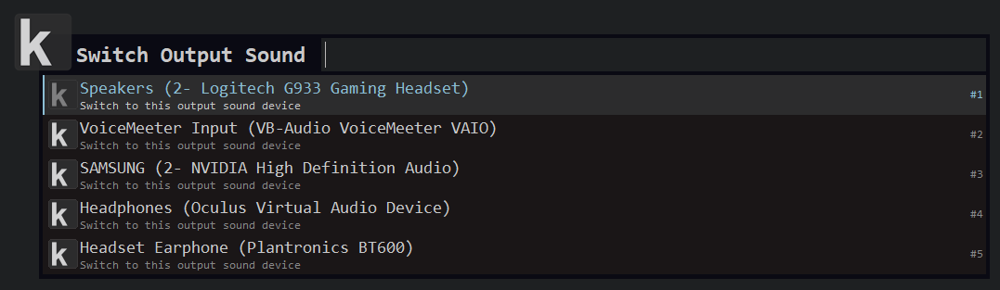

# Keypirinha Plugin: Audio Switcher

This is sound switch, a plugin for the
[Keypirinha](http://keypirinha.com) launcher.

Audio Switcher lets you change quickly the default input/output audio device of your system.

## Download

Download the latest release from [here](https://github.com/USERNAME/keypirinha-audioswitcher/releases).

## Install
Once the `audioswitcher.keypirinha-package` file is installed,
move it to the `InstalledPackage` folder located at:

* `Keypirinha\portable\Profile\InstalledPackages` in **Portable mode**
* **Or** `%APPDATA%\Keypirinha\InstalledPackages` in **Installed mode** (the
  final path would look like
  `C:\Users\%USERNAME%\AppData\Roaming\Keypirinha\InstalledPackages`)

## Change Log

### v0.1.0

* First release

## License

This package is distributed under the terms of the MIT license.

## Credits

Original location of AudioEnpointControl is: https://github.com/jonisb/AudioEndpointControl

## Contribute

1. Check for open issues or open a fresh issue to start a discussion around a
   feature idea or a bug.
2. Fork this repository on GitHub to start making your changes to the **dev**
   branch.
3. Send a pull request.
4. Add yourself to the *Contributors* section below (or create it if needed)!
